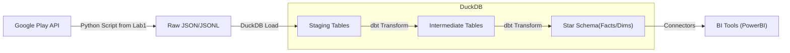

# Data Engineering Lab 2: Architecture & Data Modeling

**Architecture Diagram Concept:**

---

### 1. Identify the Business Process
We want to analyze the reception of applications by tracking user reviews and ratings over time.

### 2. Declare the Grain
**"One row in the fact table represents one individual review posted by a user for a specific app at a specific point in time."**

### 3. Identify the Dimensions
The "who, what, where, when" context to the facts

*   **Dim_App**: Describes the **"What"** (the application being reviewed).
    *   *Source*: `apps_metadata.json`
    *   *Attributes*: `App_Key` (Surrogate Key), `App_ID` (Natural Key), `Title`, `Developer`, `Genre`, `Category`, `Price`, `Free/Paid Status`, `Content Rating`, `Release Date`, `Current Version`.
    
*   **Dim_Date**: Describes the **"When"** (date of the review).
    *   *Source*: Derived from `at` timestamp in `apps_reviews.jsonl`.
    *   *Attributes*: `Date_Key`, `Full_Date`, `Year`, `Quarter`, `Month`, `Day`, `Day_of_Week`, `Is_Weekend`.

*   **Dim_User**: Describes the **"Who"** (the user who wrote the review).
    *   *Source*: `apps_reviews.jsonl`
    *   *Attributes*: `User_Key`, `User_Name`, `User_Image_URL`. 
    *   *Note*: In the dataset, user information might be limited or anonymized (e.g., "A Google User"), but structurally it remains a dimension.

### 4. Identify the Facts

*   **Fact_Reviews**:
    *   *Source*: `apps_reviews.jsonl`
    *   *Measures*:
        *   `Score`: The numerical rating (1-5 stars). Aggregations: Average, Min, Max, Count.
        *   `Thumbs_Up_Count`: Number of upvotes the review received. Aggregations: Sum, Average.
        *   `Review_Count`: Explicit count of reviews (1 per row). Aggregations: Sum.

### 5. Bus Matrix

| Business Process | Fact Table | Dim_App | Dim_Date | Dim_User |
| :--- | :--- | :---: | :---: | :---: |
| **User Reviews** | **Fact_Reviews** | **X** | **X** | **X** |

### 6. Star Schema Design

#### Table: `Fact_Reviews`
| Column Name | Type | Description |
| :--- | :--- | :--- |
| `review_id` | STRING | Primary Key (Natural) |
| `app_key` | INT | FK to Dim_App |
| `date_key` | INT | FK to Dim_Date |
| `user_key` | INT | FK to Dim_User |
| `score` | INT | Rating given (1-5) |
| `thumbs_up_count` | INT | Count of helpful votes |
| `review_content` | TEXT | The actual text of the review (Degenerate Dim) |
| `app_version` | STRING | App version at time of review (Degenerate Dim) |

#### Table: `Dim_App`
| Column Name | Type | Description |
| :--- | :--- | :--- |
| `app_key` | INT | Surrogate Primary Key |
| `app_id` | STRING | Natural Key (e.g., com.google...) |
| `title` | STRING | App Name |
| `developer` | STRING | Developer Name |
| `genre` | STRING | Primary Genre |
| `price` | DECIMAL | App Price |
| `is_free` | BOOLEAN | Free/Paid indicator |

#### Table: `Dim_Date`
| Column Name | Type | Description |
| :--- | :--- | :--- |
| `date_key` | INT | Primary Key (YYYYMMDD) |
| `date` | DATE | Full Date |
| `year` | INT | Year |
| `month` | INT | Month (1-12) |
| `month_name` | STRING | Month Name |
| `day` | INT | Day of Month |

#### Table: `Dim_User`
| Column Name | Type | Description |
| :--- | :--- | :--- |
| `user_key` | INT | Surrogate Primary Key |
| `user_name` | STRING | User display name |
| `user_image` | STRING | URL to user profile image |

### 7. Validation Against Analytical Needs
*   **"Which app has the best ratings?"**:  Query `Fact_Reviews` joined with `Dim_App`, grouping by `Dim_App.title` and averaging `Fact_Reviews.score`.
*   **"How have reviews changed over time?"**: Query `Fact_Reviews` joined with `Dim_Date`, grouping by `Dim_Date.month` and counting `review_id`.
*   **"Which developer has the most reviews?"**: Query `Fact_Reviews` joined with `Dim_App`, grouping by `Dim_App.developer`.
