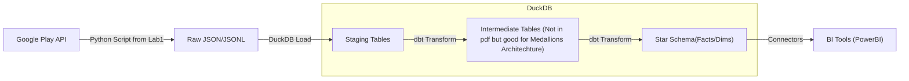

# Data Engineering Lab 2: Architecture & Data Modeling

**Architecture Diagram Concept:**

---

### 1. Identify the Business Process
We want to analyze the reception of applications by tracking user reviews and ratings over time.

### 2. Declare the Grain
**"One row in the fact table represents one individual review posted by a user for a specific app at a specific point in time."**

### 3. Identify the Dimensions
The "who, what, when" context to the facts. The analysis will be centered around the application, the developer, the category, and the date.

*   **dim_apps**: Describes the application being reviewed.
    *   *Attributes*: `app_key` (PK), `app_id` (Natural Key), `app_name`, `developer_key` (FK), `category_key` (FK), `price`, `is_paid`, `installs`, `catalog_rating`, `ratings_count`.

*   **dim_developers**: Describes the developer of the application.
    *   *Attributes*: `developer_key` (PK), `developer_name`, `developer_website`, `developer_email`.

*   **dim_categories**: Describes the category of the application.
    *   *Attributes*: `category_key` (PK), `category_name`.

*   **dim_date**: Describes the date of the review.
    *   *Attributes*: `date_key` (PK), `date`, `year`, `month`, `quarter`, `day_of_week`, `is_weekend`.

### 4. Identify the Facts

*   **fact_reviews**:
    *   *Measures*: `rating` (1-5), `thumbs_up_count`.
    *   *Keys*: `review_id` (PK), `app_key` (FK), `developer_key` (FK), `date_key` (FK).
    *   *Attributes*: `review_text`, `review_version`.

### 5. Bus Matrix

| Business Process | Fact Table | dim_apps | dim_developers | dim_categories | dim_date |
| :--- | :--- | :---: | :---: | :---: | :---: |
| **User Reviews** | **fact_reviews** | **X** | **X** | **X** | **X** |

*(Note: Developers and Categories are linked directly or transitively via Apps).*

### 6. Star Schema / Snowflake Design

The schema follows a Snowflake-like structure where dimension tables (`dim_apps`) are normalized into sub-dimensions (`dim_developers`, `dim_categories`). `fact_reviews` references `dim_apps`, `dim_developers`, and `dim_date`.

#### Table: `fact_reviews`
| Column Name | Type | Description |
| :--- | :--- | :--- |
| `review_id` | INTEGER | Primary Key |
| `app_key` | INTEGER | FK to dim_apps |
| `developer_key` | INTEGER | FK to dim_developers |
| `date_key` | INTEGER | FK to dim_date |
| `rating` | INTEGER | Rating given (1-5) |
| `thumbs_up_count` | INTEGER | Count of helpful votes |
| `review_text` | TEXT | Review content |
| `review_version` | VARCHAR | App version at time of review |

#### Table: `dim_apps`
| Column Name | Type | Description |
| :--- | :--- | :--- |
| `app_key` | INTEGER | Primary Key |
| `app_id` | VARCHAR | Natural Key (e.g., com.google...) |
| `app_name` | VARCHAR | App Title |
| `developer_key` | INTEGER | FK to dim_developers |
| `category_key` | INTEGER | FK to dim_categories |
| `price` | NUMERIC | App Price |
| `is_paid` | BOOLEAN | Free/Paid indicator |
| `installs` | VARCHAR | Install count range |
| `catalog_rating` | NUMERIC | Average rating on store (not review specific) |
| `ratings_count` | INTEGER | Total ratings count on store |

#### Table: `dim_developers`
| Column Name | Type | Description |
| :--- | :--- | :--- |
| `developer_key` | INTEGER | Primary Key |
| `developer_name` | VARCHAR | Developer Name |
| `developer_website` | VARCHAR | Website URL |
| `developer_email` | VARCHAR | Contact Email |

#### Table: `dim_categories`
| Column Name | Type | Description |
| :--- | :--- | :--- |
| `category_key` | INTEGER | Primary Key |
| `category_name` | VARCHAR | Category Name |

#### Table: `dim_date`
| Column Name | Type | Description |
| :--- | :--- | :--- |
| `date_key` | INTEGER | Primary Key (YYYYMMDD) |
| `date` | DATE | Full Date |
| `year` | INTEGER | Year |
| `month` | INTEGER | Month (1-12) |
| `quarter` | INTEGER | Quarter (1-4) |
| `day_of_week` | INTEGER | Day of Week (1-7) |
| `is_weekend` | BOOLEAN | Weekend Indicator |

### 7. Validation Against Analytical Needs
*   **"Which app has the best ratings?"**:  Query `fact_reviews` joined with `dim_apps`, grouping by `dim_apps.app_name` and averaging `fact_reviews.rating`.
*   **"How have reviews changed over time?"**: Query `fact_reviews` joined with `dim_date`, grouping by `dim_date.month` and counting `review_id`.
*   **"Which developer has the most reviews?"**: Query `fact_reviews` joined with `dim_developers`, grouping by `dim_developers.developer_name`.

This model supports all required analytical capabilities efficiently.
